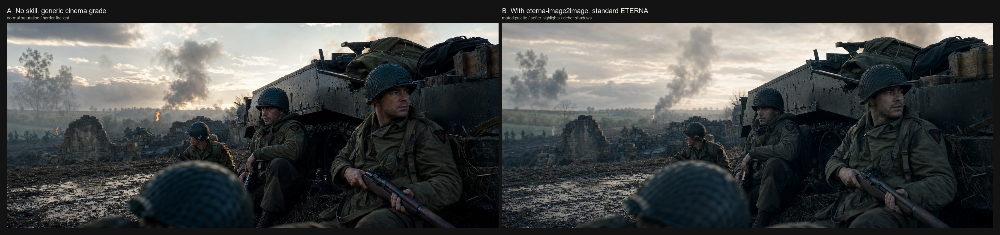
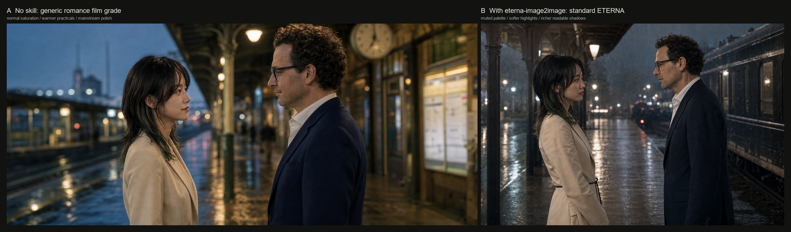
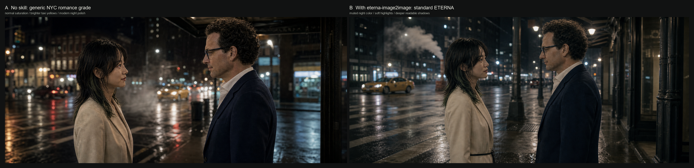
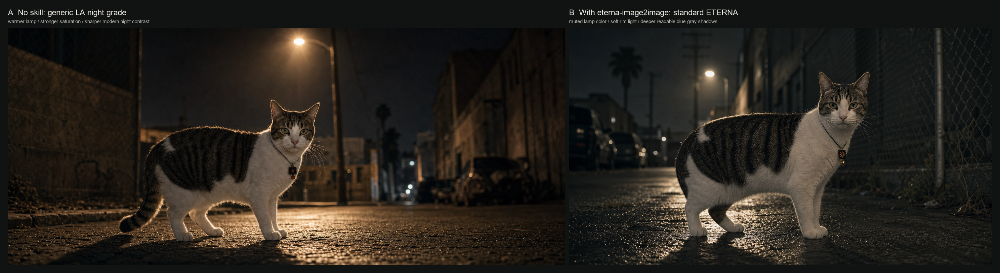
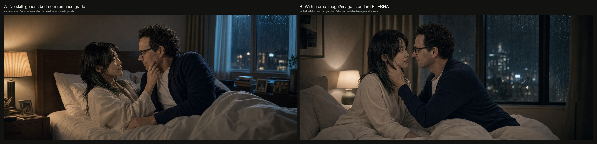

# ETERNA Image2Image Skill

Experimental bilingual Codex skill for ETERNA-inspired image-to-image cinematic color, tone, composition, and anti-AI polish.

This is an experimental skill that I am actively improving. The goal is to help image2image outputs become more cinematic through color discipline, composition guidance, lighting restraint, texture control, and stronger negative constraints, while reducing the obvious "AI-generated" feeling. Forks, tests, critiques, and pull requests are welcome.

> Not affiliated with Fujifilm. "ETERNA" is used here as an inspiration and descriptive reference for a restrained cinema look. This repo does not include official Fujifilm LUTs or proprietary color science.

## What It Does

- Applies an ETERNA-inspired cinema grade: muted saturation, soft highlight roll-off, readable shadows, natural skin, restrained greens and steel blues.
- Guides image2image edits toward film still composition rather than generic AI portrait output.
- Preserves subject identity, scene logic, camera perspective, and motivated lighting unless the user asks for a creative rewrite.
- Provides three working modes: `standard-eterna`, `clean-cinema-eterna`, and `eterna-bleach-bypass`.
- Includes practical palette, negative constraints, LUT workflow notes, and cinematic composition guidance.

## Install

PowerShell:

```powershell
$skillsDir = Join-Path $env:USERPROFILE ".codex\skills"
New-Item -ItemType Directory -Force -Path $skillsDir | Out-Null
Copy-Item -Recurse -Force ".\skill\eterna-image2image" $skillsDir
```

macOS / Linux:

```bash
mkdir -p "${CODEX_HOME:-$HOME/.codex}/skills"
cp -R skill/eterna-image2image "${CODEX_HOME:-$HOME/.codex}/skills/"
```

## Usage

Ask Codex to use the skill explicitly:

```text
Use $eterna-image2image to transform this image into a professional ETERNA-inspired cinema still.
```

For A/B testing:

```text
Generate one version without the skill and one version with $eterna-image2image standard-eterna, then compare them side by side.
```

## Sample Tests

The following samples are early image2image test frames. They are not final benchmarks; they are included to show the current direction of the skill.

### War Film Frame



### Romance Film Frame



### Deep Night NYC Street Corner



### LA Alley Night Exterior



### Bedroom Romance Frame



## Repository Layout

```text
skill/eterna-image2image/
  SKILL.md
  agents/openai.yaml
  references/
    eterna-color-spec.md
    composition-guide.md
    lut-workflow.md
examples/
  *.png
```

## Roadmap

- Refine scene-specific prompt blocks for war, romance, night exterior, interior drama, documentary, and editorial stills.
- Add more controlled A/B samples with identical subjects and scene prompts.
- Improve composition heuristics for reducing generic centered AI framing.
- Add optional color-check scripts for palette sampling and saturation/contrast diagnostics.
- Explore user-supplied reference still workflows without bundling copyrighted or proprietary LUT assets.

## Contributing

Forks are welcome. Useful contributions include:

- Better ETERNA-inspired color prompts and negative constraints.
- New A/B comparison samples with clear prompt notes.
- Composition and lighting heuristics that reduce AI artifacts.
- Compatibility notes for different image generation models.

---

# ETERNA Image2Image Skill 中文说明

这是一个中英双语、实验性的 Codex skill，用于为 image2image 图生图工作流提供 ETERNA 启发的电影级色彩、影调、构图和反 AI 味优化。

这个 skill 仍在持续完善中。我的目标是让图生图结果从色彩、构图、光线、质感和负向约束等方向更接近电影截图，减少常见的 AI 生成感。欢迎大家 fork、测试、提出建议或提交 PR。

> 本项目与 Fujifilm 无官方关联。这里的 "ETERNA" 仅作为一种克制、电影化色彩方向的灵感参考。本仓库不包含官方 Fujifilm LUT，也不声称复刻专有色彩科学。

## 它解决什么问题

- 给图生图结果加入 ETERNA 启发的电影调色：低饱和、柔和高光、可读暗部、自然肤色、克制的橄榄绿和钢蓝色。
- 引导画面更像电影截图，而不是常见的 AI 头像照、宣传照或过度锐化的数字照片。
- 默认保留人物身份、场景逻辑、镜头透视和主要光线，只在用户明确要求时做创意改写。
- 提供三种工作模式：`standard-eterna`、`clean-cinema-eterna`、`eterna-bleach-bypass`。
- 附带实用色盘、负向约束、LUT 工作流说明和电影构图参考。

## 安装

PowerShell:

```powershell
$skillsDir = Join-Path $env:USERPROFILE ".codex\skills"
New-Item -ItemType Directory -Force -Path $skillsDir | Out-Null
Copy-Item -Recurse -Force ".\skill\eterna-image2image" $skillsDir
```

macOS / Linux:

```bash
mkdir -p "${CODEX_HOME:-$HOME/.codex}/skills"
cp -R skill/eterna-image2image "${CODEX_HOME:-$HOME/.codex}/skills/"
```

## 使用方式

可以直接要求 Codex 使用这个 skill：

```text
使用 $eterna-image2image，把这张图转成专业 ETERNA 启发的电影截图。
```

做对比测试时可以这样说：

```text
生成一张不用 skill 的版本，再生成一张使用 $eterna-image2image standard-eterna 的版本，并做左右对比。
```

## 当前状态

这是一个不断迭代的实验性 skill。它目前更像一个专业电影感图生图提示词与审美约束系统，而不是精确复刻某一台摄影机、某一个 LUT 或某一套官方胶片模拟。后续会继续补充更多测试样张、场景预设、构图规则和质量检查方法。

